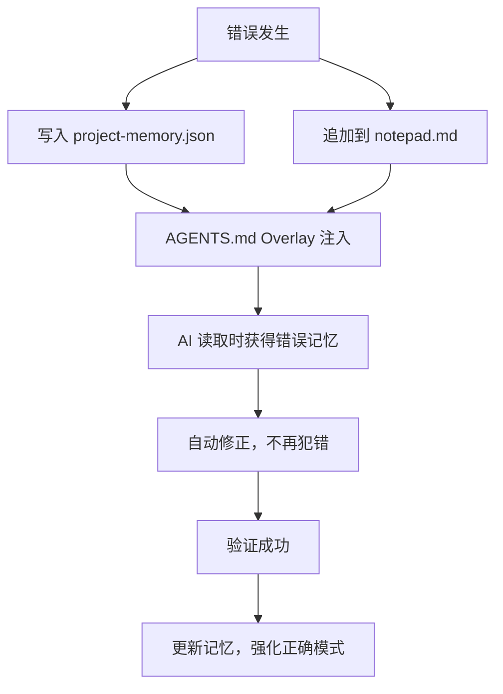

# 熵管理实现分析

基于 oh-my-codex 代码的熵管理机制深度解析。

## 概述

熵管理是 Harness Engineer 的第六个模块，作为"免疫系统"确保系统长期健康和持续进化。oh-my-codex 通过以下四个核心机制实现熵管理：

1. **项目记忆持久化** (.omx/project-memory.json)
2. **会话便签系统** (.omx/notepad.md)
3. **运行时叠加层** (AGENTS.md Overlay)
4. **反馈回路集成**

---

## 1. 项目记忆持久化

### 存储位置
```
.omx/project-memory.json
```

### 数据结构

```typescript
interface ProjectMemory {
  techStack?: string;           // 技术栈
  build?: string;               // 构建命令
  conventions?: string;         // 代码约定
  structure?: string;           // 项目结构
  notes?: Array<{               // 分类笔记
    category: string;
    content: string;
    timestamp: string;
  }>;
  directives?: Array<{          // 持久化指令
    directive: string;
    priority: string;           // 'high' | 'normal'
    context?: string;
    timestamp: string;
  }>;
}
```

### MCP 工具接口

#### `project_memory_write`
- **功能**: 写入/更新项目记忆
- **模式**: merge（合并）或 replace（替换）
- **用途**: 保存技术栈、约定等长期信息

#### `project_memory_add_directive`
- **功能**: 添加持久化指令
- **优先级**: high（高优先级）或 normal（普通）
- **用途**: 记录错误修正方案、架构约束等

#### `project_memory_add_note`
- **功能**: 添加分类笔记
- **分类**: build, test, deploy, env, architecture
- **用途**: 记录特定领域的经验教训

### 实现示例

```typescript
// 添加错误修正指令
await project_memory_add_directive({
  directive: "不要在循环中创建数据库连接",
  priority: "high",
  context: "性能优化 - 避免连接泄漏"
});

// 添加架构笔记
await project_memory_add_note({
  category: "architecture",
  content: "所有 API 调用必须通过 service 层，不能直接在 controller 中调用"
});
```

---

## 2. 会话便签系统

### 存储位置
```
.omx/notepad.md
```

### 三个核心区段

#### PRIORITY (优先级上下文)
- **写入方式**: 替换式（覆盖）
- **长度限制**: 500 字符
- **用途**: 当前任务的关键上下文

#### WORKING MEMORY (工作记忆)
- **写入方式**: 追加式
- **格式**: `[timestamp] {content}`
- **清理**: 支持按天数自动清理
- **用途**: 临时工作状态、中间结果

#### MANUAL (手动记录)
- **写入方式**: 追加式
- **清理**: 永不自动清理
- **用途**: 用户手动记录的重要信息

### MCP 工具接口

#### `notepad_write_priority`
```typescript
// 替换优先级上下文
await notepad_write_priority({
  content: "当前正在修复用户认证模块的 JWT 验证问题"
});
```

#### `notepad_write_working`
```typescript
// 追加工作记忆
await notepad_write_working({
  content: "发现 token 验证逻辑在过期时间判断上有 bug"
});
// 结果: [2026-04-04T12:34:56.789Z] 发现 token 验证逻辑在过期时间判断上有 bug
```

#### `notepad_write_manual`
```typescript
// 手动记录（永不清理）
await notepad_write_manual({
  content: "重要：生产环境 JWT secret 必须从环境变量读取"
});
```

#### `notepad_prune`
```typescript
// 清理 7 天前的工作记忆
await notepad_prune({ daysOld: 7 });
```

#### `notepad_stats`
```typescript
// 获取便签统计信息
const stats = await notepad_stats();
// 返回: { size, entryCount, oldestEntry, newestEntry, sections: { priority, working, manual } }
```

---

## 3. 运行时叠加层

### 工作原理

在每次会话启动时，动态注入上下文到 AGENTS.md，会话结束后自动清理。

### 注入内容

#### Codebase Map (代码库映射)
- **最大长度**: 1000 字符
- **内容**: 目录/模块结构
- **用途**: Token 高效的代码库探索

#### Active Modes (活跃模式)
- **最大长度**: 600 字符
- **内容**: 当前运行的模式状态
- **示例**:
  ```
  - ralph: iteration 3/5, phase: verification
  - autopilot: phase: execution
  ```

#### Priority Notes (优先级便签)
- **最大长度**: 600 字符
- **内容**: 从 notepad.md 的 PRIORITY 区段提取
- **用途**: 当前任务的关键上下文

#### Project Context (项目上下文)
- **最大长度**: 1000 字符
- **内容**: 从 project-memory.json 提取
- **示例**:
  ```
  - Stack: TypeScript + Node.js + PostgreSQL
  - Conventions: 使用 ESLint + Prettier
  - Build: npm run build
  - Directive: 所有 API 必须返回统一格式
  ```

#### Compaction Protocol (压缩协议)
- **最大长度**: 380 字符
- **内容**: 上下文管理指令
- **示例**:
  ```
  Before context compaction, preserve critical state:
  1. Write progress checkpoint via state_write MCP tool
  2. Save key decisions to notepad via notepad_write_working
  3. If context is >80% full, proactively checkpoint state
  ```

### 文件锁机制

```typescript
// 获取锁（带超时）
await acquireLock(cwd, 5000);

// 释放锁
await releaseLock(cwd);

// 使用锁保护操作
await withAgentsMdLock(cwd, async () => {
  // 修改 AGENTS.md
});
```

### 溢出处理策略

当叠加内容超过 3500 字符时，按优先级丢弃：

1. **必需**: Session metadata, Compaction protocol
2. **可选**: Codebase map, Active modes, Priority notes, Project context
3. **丢弃顺序**: 从可选区段末尾开始，直到符合限制

---

## 4. 反馈回路集成

### 完整流程



### 实际案例

#### 场景 1: 错误修正

```typescript
// 1. 发现错误
const error = "在循环中创建数据库连接导致连接泄漏";

// 2. 记录到项目记忆
await project_memory_add_directive({
  directive: "不要在循环中创建数据库连接",
  priority: "high",
  context: "性能优化 - 避免连接泄漏"
});

// 3. 记录到便签
await notepad_write_working({
  content: `修复: ${error} - 改为在循环外创建连接池`
});

// 4. 下次会话时，AGENTS.md 自动注入
// **Project Context:**
// - Directive: 不要在循环中创建数据库连接

// 5. AI 自动避免此错误
```

#### 场景 2: 架构约定

```typescript
// 1. 确立约定
await project_memory_write({
  memory: {
    conventions: "所有 API 调用必须通过 service 层",
    structure: "controller -> service -> repository -> database"
  },
  merge: true
});

// 2. 添加高优先级指令
await project_memory_add_directive({
  directive: "禁止在 controller 中直接调用 repository",
  priority: "high"
});

// 3. 后续开发自动遵循约定
```

---

## 核心特性总结

| 特性 | 实现方式 | 作用 |
|------|---------|------|
| **永久化** | JSON + MD 文件存储 | 跨会话持久化 |
| **可追溯** | 所有条目带时间戳 | 历史记录可查 |
| **可清理** | 按天数自动清理 | 防止数据膨胀 |
| **可整合** | 运行时动态注入 | AI 自动获取 |
| **原子性** | 文件锁机制 | 防止并发冲突 |
| **优先级** | high/normal 分级 | 重要信息优先 |
| **分类** | 多维度分类 | 结构化管理 |

---

## 最佳实践

### 1. 错误记录

```typescript
// 高优先级错误
await project_memory_add_directive({
  directive: "错误描述 + 修正方案",
  priority: "high",
  context: "错误场景"
});

// 同时记录到便签
await notepad_write_working({
  content: "错误: xxx, 修正: xxx"
});
```

### 2. 架构约定

```typescript
// 技术栈
await project_memory_write({
  memory: {
    techStack: "TypeScript + Node.js + PostgreSQL",
    build: "npm run build",
    conventions: "ESLint + Prettier"
  }
});

// 高优先级指令
await project_memory_add_directive({
  directive: "所有 API 必须返回统一格式: { code, data, message }",
  priority: "high"
});
```

### 3. 上下文管理

```typescript
// 开始任务时
await notepad_write_priority({
  content: "当前任务: xxx"
});

// 工作中
await notepad_write_working({
  content: "进度: xxx"
});

// 定期清理
await notepad_prune({ daysOld: 7 });
```

---

## 相关文件

- `src/mcp/memory-server.ts` - 记忆和便签 MCP 服务器
- `src/hooks/agents-overlay.ts` - AGENTS.md 运行时叠加
- `src/utils/paths.ts` - 路径工具函数
- `AGENTS.md` - 主操作契约

---

## 参考文档

- [Harness Engineer](/harness/harness-engineer) - 熵管理理论框架
- [Claw Code: 24小时10万Star](/harness/claw-code-omx-100k-stars) - 实战案例
